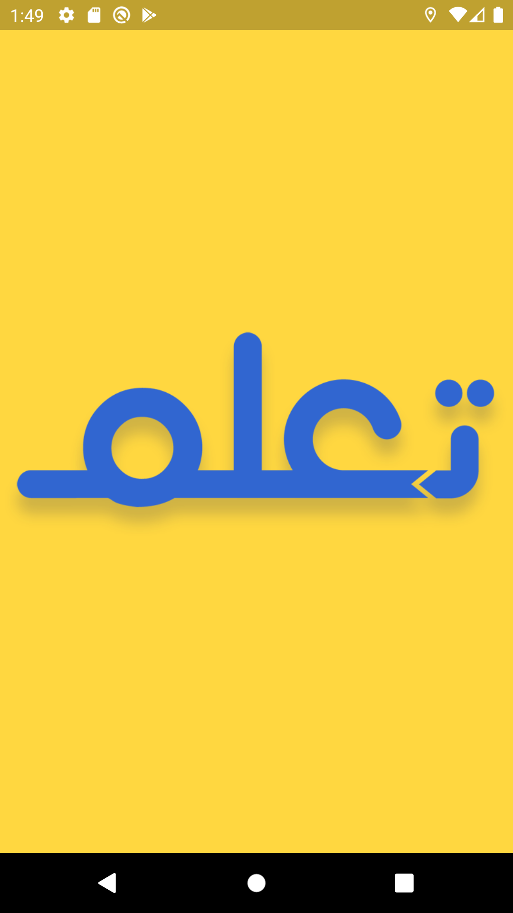
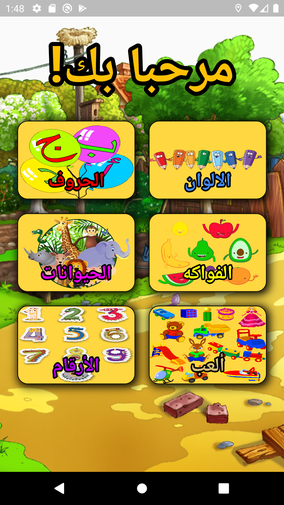
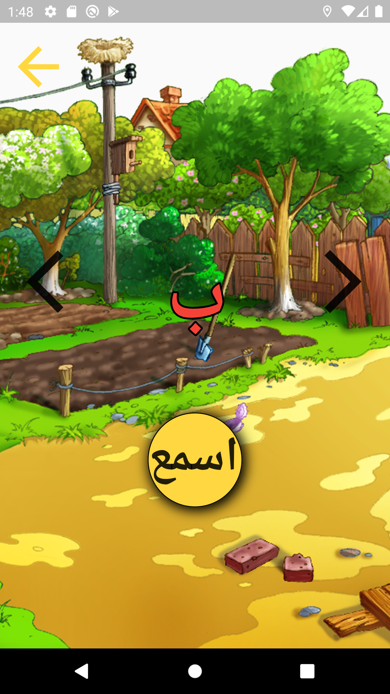
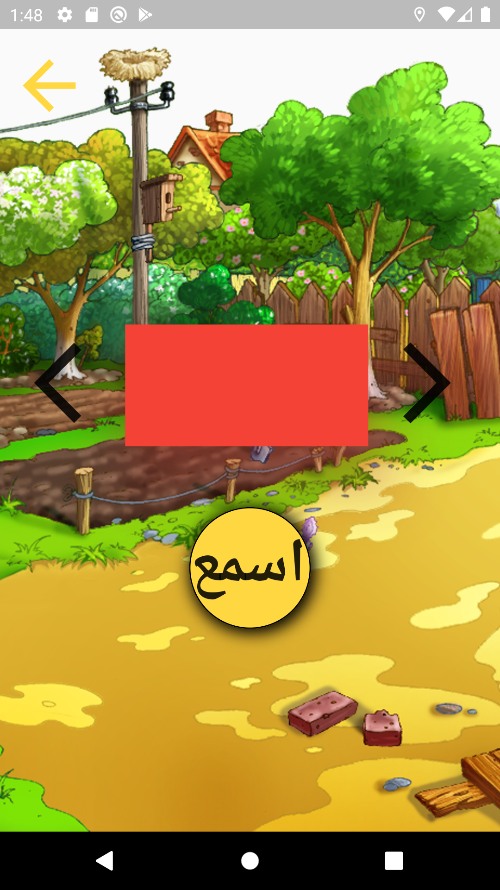
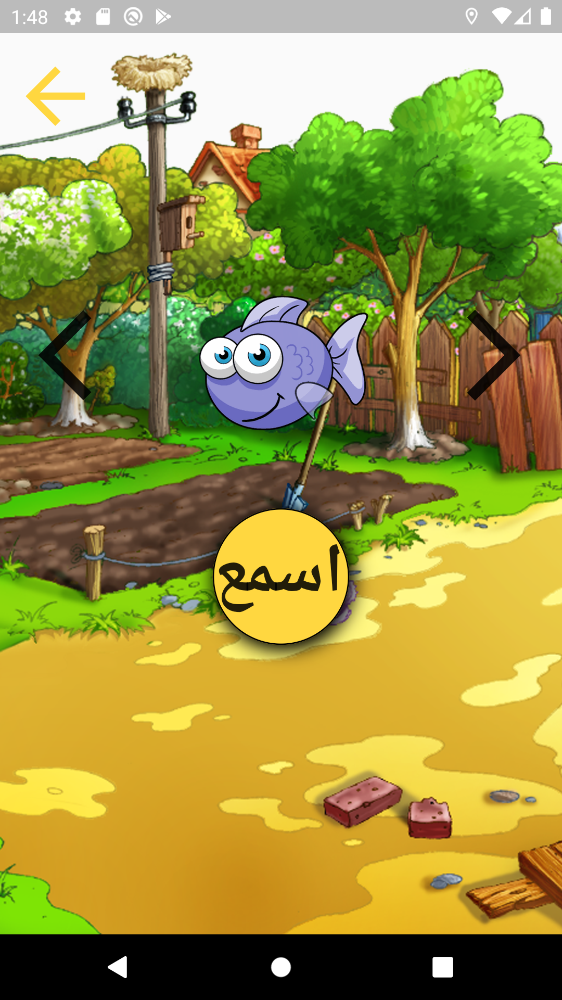
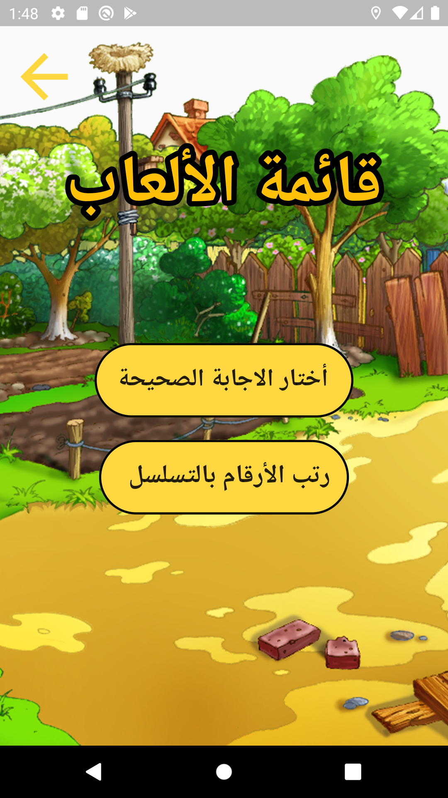
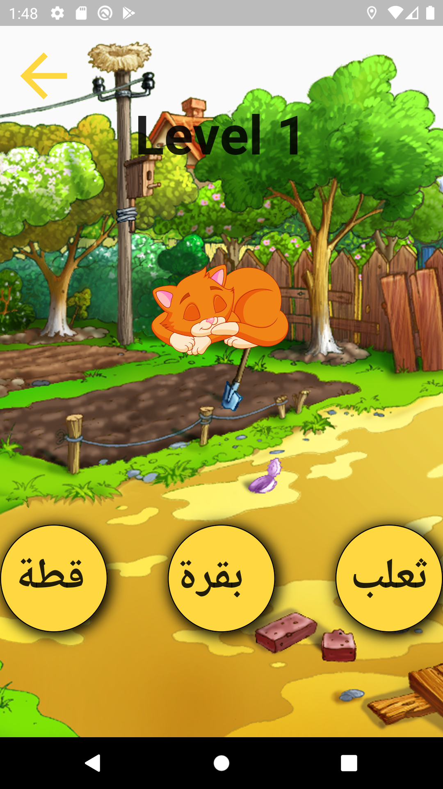
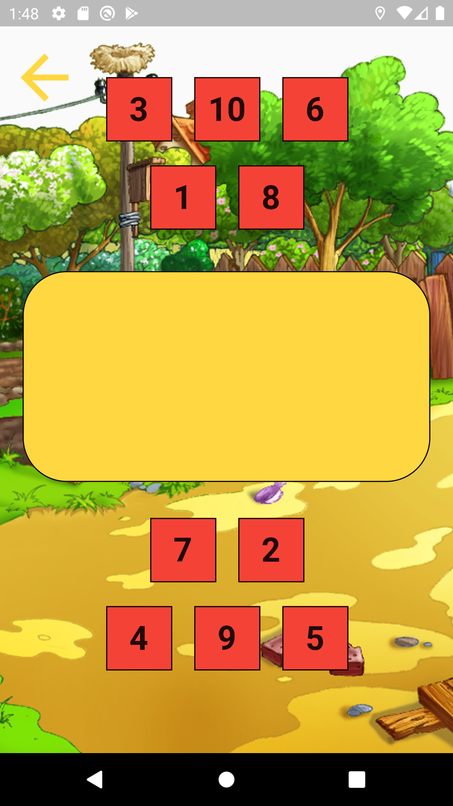
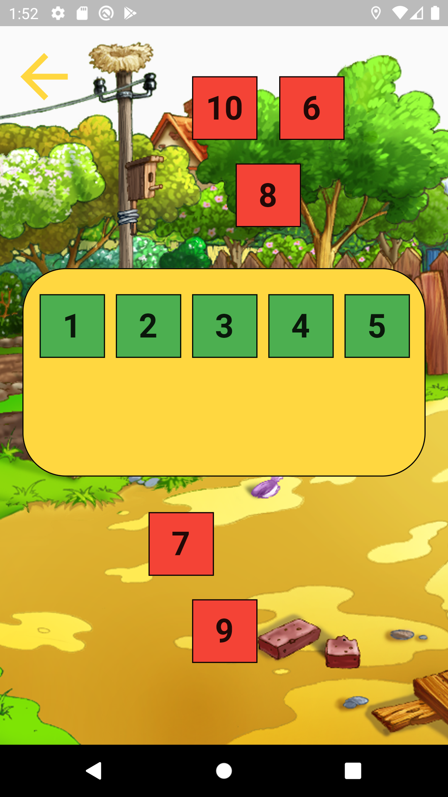

# arabic_learning_app
It is an application to teach kids arabic language by teach them all arabic letters , colors names , animals names , number names and more !
and there are games that can play them for fun and learn arabic.

# Screenshots

  

 

